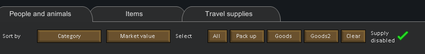
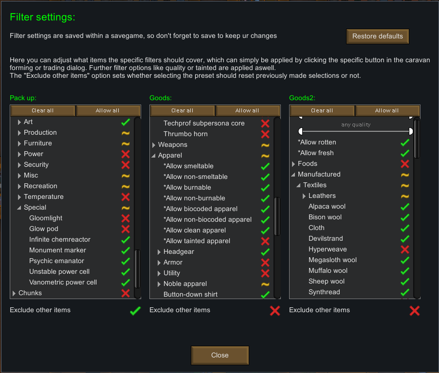

# Caravan forming / trading preset filter settings

Instead of manually selecting each item for your caravan whether it be for a trading caravan or to settle at a new site, a new feature is introduced in order to make this experience a lot better.

Your caravan forming and trade menus now contain additional buttons allowing you to allow you to: 
* select all items at once
* select predefined items for each of the 3 available presets
* reset the entire selection
* disable the automatic supply selection of the "Travel supplies" tab when the dialog is opened, which can cause considerable lag when active

The 3 presets can be set in your mod settings and allow you to fine tune all items you'd like to be selected by each preset:

You can further limit the item selecting by using the specialized filter settings that the filter dialog offers.

The last option in each row allows you to set whether using a preset will reset other item selections that you may have toggled or not. For the typical "Pack up" preset this may make sense to only include what you'd want on your journey, however for presets you may use for trading, you may also want to sell other goods, so selecting those shouldn't reset other selections.

And a short preview in action:

 <a href="2 Camping.md">Last page</a> <--> <a href="4 MechanoidBounty.md">Next page</a>