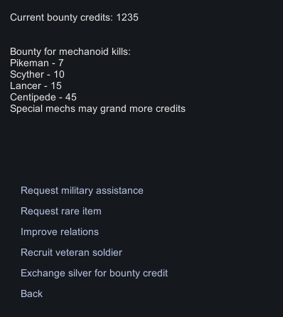

# Mechanoid Bounty

If you play with the story enabled, the story faction will call out a bounty on mechanoids, if not, you can choose the faction in modsettings, which by default falls to the civil outlanders.

Once the bounty is called out and you receive the notification, the hunt can begin. Every Mechanoid kill your colonists or structures pull off will reward your bounty credit balance with a certain amount of points. 

To trade in these points for services provided by the bounty faction, simply reach out to them via the comms console and choose "Bounty Services":
| | |
--- | ---
 | Your currently collected bounty points    The bounty rewards you can gain for the different mech types.   Mechs provided by other mods all reward 12 points, however the third   party mod support section below describes how you can add   additional supported factions or bounty point rewards for your mod      - Request military assistance ranging between 6 and 30 soldiers   - Exchange bounty points for rare items   - Use envoys in exchange for bounty credits to improve your relations   - Permenantely recruit skilled veteran soldiers and choose some of their traits   - Exchange your hard earned silver for more bounty credits (4 silver ~ 1 bc)    

## Mod Settings

* Choose the faction calling out the bounty if you do not have the storyline active
* adjust the durations, when item restocks happen or how long services won't be available after use
* allow bounty points being collected by structures (e.g. turrets)
* Allow the exchange of silver for bounty credits
* Adjust the silver to bounty credit value modifier 

## Third party mod support

The CompatibilityDef can be patched in order to register new factions and new bounty point reward allocations for your mod's mech races.  
The CompatibilityDef is located at Defs/Compatibility/CompatibilityDef.xml

To register new Factions, you can patch them into the ``<additionalBountyFactionDefsToAdd/>`` node.  
To register a bounty value for a new race you can patch in a new ``<li/>`` list entry under the ``<mechanoidBountyToAdd/>`` node.

 <a href="1 General.md">Next page</a> <--> <a href="3 3 CaravanFormingTradingPresetFilters.md">Next page</a>