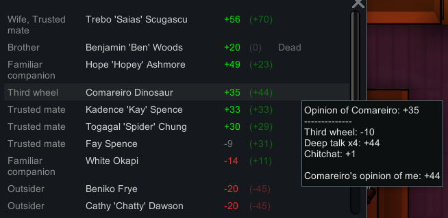

# Travel Companions

Fighting along side each other on countless adventures, mastering the cruelest of twists together, yet even after years together pawns may end up liking a new pawn instantly more then they may do most of their group. That didn't seem right. 

This feature introduces a new relationship kind between your pawns that strenghtens over time the longer they are together. This new relationship morrors itself in the personal mood of the individual pawn aswell as their personal relation towards each other pawn in your group. 

While this offers the chance for pawns, that have known each other for many years and faced countless challenges together, to really feel like an inportant part of their group, it also leads to distrust and some discontent against newcomers. Where did they come from? Why did they join and can they be trusted? Or will they cause the collapse of your group? The same way a new pawn will feel uncertain about their fate in their new group and home. How will they be treated? Will they ever be the odd one out? Are they even save?

While your pawns get to know each other better, the following stages can be reached with time: 
* Outsider      
  * Mood: -6 
  * Oppinion: -20  

  *I had no choice but to join them... i'd have died alone, but i'm scared what they might do to me.*
* Thrid wheel
  * Mood: -2
  * Oppinion: -10

  *I don't really know these people, should i stay?*
* Familiar companion
  * Mood: 1
  * Oppinion: 10

  *Most jokes are on me and i get to do all the crappy work, but i seem to start being accepted!*
* Part of the gang
  * Mood: 4
  * Oppinion: 20

  *My companions start to value my skills and insight, i get to sit at the table!*
* Trusted mate
  * Mood: 8
  * Oppinion: 30

  *My companions are there when i need them and they can count on me!*
* True friend
  * Mood: 12
  * Oppinion: 40

  *We have been through alot together and always have each others backs. We would die for each other!*

## Mod Support
The CompatibilityDef, which was mentioned in Mechanoid Bounty in more detail offers the ability to either exclude certain races from the feature, or exclude multiple race defs with help of a modextension.

To exclude single factions add them to the ``<raceDefsToExcludeFromTravelCompanions/>`` node.  
To exclude races with help of a modextension use ``<racesWithModExtsToExcludeFromTravelCompanions/>``

 <a href="1 General.md">Next page</a> <--> <a href="3 3 CaravanFormingTradingPresetFilters.md">Next page</a>